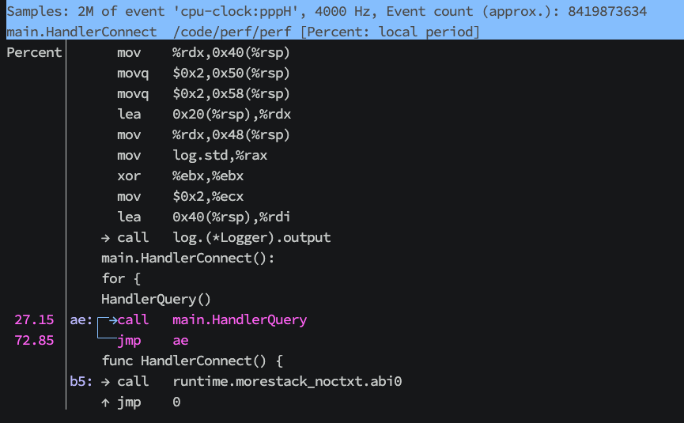

在计算机的世界里, 程序运行的每一纳秒都在上演着无数微观事件: CPU 的指令执行、缓存的命中与失效、内存的分配与回收……这些事件如同宇宙中的暗物质, 虽然看不见摸不着, 却主宰着程序的性能命运。

早期的开发者们如同在迷雾中前行, 只能依赖粗糙的计时器和日志猜测性能瓶颈。直到 Perf 的出现——它像一台精密的显微镜, 将程序运行的每一个细节放大到可见的维度；又像一台时光机, 能回放代码执行的每一帧画面。

Perf 诞生于 Linux 内核社区, 最初由 Ingo Molnar 等人推动, 现已成为 Linux 性能分析的瑞士军刀。它直接与硬件性能计数器（Performance Monitoring Unit, PMU）对话, 能捕捉从 CPU 指令、缓存失效到系统调用的全维度数据。

## 简介

perf list 是 Linux 性能分析工具 perf 中的一个命令, 用于列出当前系统支持的硬件和软件性能监控事件。这些事件可以用于性能分析、调优和调试。perf 是 Linux 内核提供的一个强大的性能分析工具, 支持 CPU、内存、I/O 等各方面的性能监控。

perf list 命令会列出系统支持的以下类型的事件: 

* **硬件事件（Hardware Events）**: 由 CPU 的性能监控单元（PMU, Performance Monitoring Unit）提供。
例如: CPU 周期、指令数、缓存命中/失效、分支预测等。

* **软件事件（Software Events）**: 由 Linux 内核提供的基于软件的性能事件。
例如: 上下文切换、页错误、CPU 迁移等。

* **内核 PMU 事件（Kernel PMU Events）**: 特定于内核的性能监控事件。例如: CPU 缓存事件、TLB 事件等。

* **Tracepoint 事件（Tracepoint Events）**: 内核中静态定义的跟踪点, 用于监控内核和用户空间的行为。例如: 系统调用、调度事件、文件系统操作等。

* **动态探针事件（Dynamic Tracing Events）**: 通过 kprobes 和 uprobes 动态插入的探针事件。例如: 监控内核函数或用户空间函数的调用。

perf 有多个子命令, 我们可以根据 `perf -h` 查看其所有子命令, 以下是常用的子命令介绍:

| 子命令     | 功能描述                                                                   | 使用场景                                                         |
| ---------- | -------------------------------------------------------------------------- | ---------------------------------------------------------------- |
| `record`   | 记录程序的性能数据（如 CPU 使用率、函数调用栈等）, 生成 `perf.data` 文件。 | 用于事后分析程序的性能瓶颈, 支持生成火焰图（Flame Graph）。      |
| `report`   | 解析 `perf.data` 文件, 展示性能分析结果（如热点函数、调用栈等）。          | 查看 `perf record` 记录的性能数据, 定位 CPU 热点或函数调用关系。 |
| `top`      | 实时显示系统中或某个进程的 CPU 使用率最高的函数。                          | 实时监控程序的性能瓶颈, 类似 `top` 命令, 但精确到函数级别。      |
| `stat`     | 统计程序的整体性能指标（如 CPU 周期、缓存命中率、分支预测错误等）。        | 快速评估程序的整体性能, 适合初步性能分析。                       |
| `trace`    | 追踪程序的系统调用和信号事件。                                             | 分析程序的系统调用行为, 定位 I/O 或内核相关问题。                |
| `annotate` | 将性能数据映射到源代码或汇编代码, 显示热点代码行。                         | 深入分析热点函数的代码行, 定位具体的性能瓶颈。                   |
| `list`     | 列出当前系统支持的硬件和软件性能事件。                                     | 查看可监控的性能事件（如 CPU 周期、缓存失效等）。                |
| `probe`    | 动态插入探针（kprobe 或 uprobe）, 用于跟踪内核或用户空间函数。             | 动态监控特定函数或代码行的执行情况。                             |


## 实验前准备

我们准备一个 golang 应用程序将用于后续 perf 实验. 当然, 你也可以使用你习惯的语言编写 :)

```go
// 执行 `go build -o app` 编译成二进制包

package main

import (
	"net/http"
	"time"
)

func main() {
	ch := make(chan struct{})
	go func() {
		for {
			_, _ = http.NewRequest(http.MethodGet, "https://github.com", nil)
			count()

			time.Sleep(time.Second * 2)
			println("ok")
		}
	}()

	<-ch
}

func count() {
	var sum int
	for i := 0; i < 100_000_000; i++ {
		sum += i
	}
}
```

## 子命令实践

### perf list

perf list 是 perf 工具中的一个非常实用的命令, 它的作用是列出当前系统支持的所有硬件和软件性能事件。这些性能事件可以用于后续的性能分析工作, 如性能计数、热点分析等。
通过执行 perf list, 你可以查看当前系统中支持的所有硬件和软件性能事件。这些事件包括 CPU 性能计数（如 CPU 周期、指令计数等）、内存事件（如缓存未命中）、硬件事件（如分支预测错误）以及软件事件（如上下文切换）。

> 支持自定义事件: perf list 不仅列出内核预定义的硬件和软件事件, 还可以通过自定义性能事件来扩展, 帮助进行特定领域的分析。

我们可以执行 `perf list --help` 查看命令描述

```shell
$ perf list --help

perf list [<options>] [hw|sw|cache|tracepoint|pmu|sdt|metric|metricgroup|event_glob]

    -d, --desc            # 打印额外的事件描述。--no-desc 表示不打印。
    -v, --long-desc       # 打印更长的事件描述, 提供更详细的信息。
    --debug               # 启用调试输出。
    --deprecated          # 打印已弃用的事件。
    --details             # 打印关于性能事件名称和内部使用的表达式的详细信息。
```

我们可以查看当前 linux kernal 版本支持的 tracepoint

```shell

$ perf list tracepoint --details

List of pre-defined events (to be used in -e):

  alarmtimer:alarmtimer_cancel                       [Tracepoint event]
  alarmtimer:alarmtimer_fired                        [Tracepoint event]
  alarmtimer:alarmtimer_start                        [Tracepoint event]
  alarmtimer:alarmtimer_suspend                      [Tracepoint event]
  amd_cpu:amd_pstate_perf                            [Tracepoint event]
  avc:selinux_audited                                [Tracepoint event]
  block:block_bio_backmerge                          [Tracepoint event]
  block:block_bio_bounce                             [Tracepoint event]
  block:block_bio_complete                           [Tracepoint event]
  block:block_bio_frontmerge                         [Tracepoint event]
  block:block_bio_queue                              [Tracepoint event]
  block:block_bio_remap                              [Tracepoint event]
  block:block_dirty_buffer                           [Tracepoint event]
  block:block_getrq                                  [Tracepoint event]
  block:block_plug                                   [Tracepoint event]
  block:block_rq_complete                            [Tracepoint event]
  block:block_rq_insert                              [Tracepoint event]
  block:block_rq_issue                               [Tracepoint event]
  block:block_rq_merge                               [Tracepoint event]
  block:block_rq_remap                               [Tracepoint event]
  block:block_rq_requeue                             [Tracepoint event]
  block:block_split                                  [Tracepoint event]
  block:block_touch_buffer                           [Tracepoint event]
  block:block_unplug                                 [Tracepoint event]
  bpf_test_run:bpf_test_finish                       [Tracepoint event]
  bpf_trace:bpf_trace_printk                         [Tracepoint event]
  bridge:br_fdb_add                                  [Tracepoint event]
  bridge:br_fdb_external_learn_add                   [Tracepoint event]
  bridge:br_fdb_update                               [Tracepoint event]
  bridge:fdb_delete                                  [Tracepoint event]
  btrfs:__extent_writepage                           [Tracepoint event]
  btrfs:add_delayed_data_ref                         [Tracepoint event]
  btrfs:add_delayed_ref_head                         [Tracepoint event]
  btrfs:add_delayed_tree_ref                         [Tracepoint event]

  ......
```

我们也可以查看 io enter 相关的 syscall 系统调用
```shell
$ perf list tracepoint --details | grep -e "syscalls:sys_enter_io_.*"
  syscalls:sys_enter_io_cancel                       [Tracepoint event]
  syscalls:sys_enter_io_destroy                      [Tracepoint event]
  syscalls:sys_enter_io_getevents                    [Tracepoint event]
  syscalls:sys_enter_io_pgetevents                   [Tracepoint event]
  syscalls:sys_enter_io_setup                        [Tracepoint event]
  syscalls:sys_enter_io_submit                       [Tracepoint event]
  syscalls:sys_enter_io_uring_enter                  [Tracepoint event]
  syscalls:sys_enter_io_uring_register               [Tracepoint event]
  syscalls:sys_enter_io_uring_setup                  [Tracepoint event]
```

### perf trace

perf trace 是 perf 工具的一部分, 用于实时跟踪和显示进程的系统调用、信号事件、以及其他与内核交互的事件。它提供了类似于 `strace` 的功能, 但在性能分析的上下文中, 它**具有更低的开销**, 并能与 perf 工具的其他功能集成使用。

perf trace 的作用:
* **跟踪系统调用:** perf trace 可以跟踪进程发出的系统调用（如 `read()`, `write()`, `open()` 等）, 帮助分析进程与操作系统之间的交互。
* **跟踪信号事件:** 可以跟踪信号的发送与接收, 帮助诊断进程的信号处理和信号处理程序的行为。
* **性能分析:** 通过结合其他 perf 命令, perf trace 可帮助定位性能瓶颈, 分析系统调用的开销、延迟和频率等。
* **实时监控:** perf trace 提供实时的系统调用跟踪, 允许开发人员在程序执行过程中对其行为进行实时分析。

我们可以执行 `perf trace --help` 查看命令描述. 稍微有点多 :)

```shell
$ perf trace --help
Usage: perf trace [<options>] [<command>]
    or: perf trace [<options>] -- <command> [<options>]
    or: perf trace record [<options>] [<command>]
    or: perf trace record [<options>] -- <command> [<options>]

    -a, --all-cpus        # 系统范围的收集，监控所有 CPU
    -C, --cpu <cpu>       # 指定要监控的 CPU 列表
    -D, --delay <n>       # 在程序启动后等待 n 毫秒再开始测量
    -e, --event <event>   # 事件或系统调用选择器。使用 'perf list' 查看可用的事件
    -f, --force           # 强制执行，不会报错，直接执行
    -F, --pf <all|maj|min> # 跟踪页面故障（Pagefaults），可以选择跟踪所有页面故障、重大页面故障或轻微页面故障
    -G, --cgroup <name>   # 只监控指定 cgroup 名称中的事件
    -i, --input <file>    # 分析指定文件中的事件
    -m, --mmap-pages <pages>  # 设置 mmap 数据页的数量
    -o, --output <file>   # 设置输出文件名
    -p, --pid <pid>       # 跟踪指定进程 ID（PID）中的事件
    -s, --summary         # 仅显示系统调用摘要及其统计信息
    -S, --with-summary    # 显示所有系统调用以及带有统计信息的摘要
    -t, --tid <tid>       # 跟踪指定线程 ID（TID）中的事件
    -T, --time            # 显示完整的时间戳，而不是相对于开始的时间
    -u, --uid <user>      # 跟踪指定用户（UID）的进程
    -v, --verbose         # 增加输出的详细信息
        --call-graph <record_mode[,record_size]>  # 设置并启用调用图（堆栈链/回溯）：
                               #   record_mode:  调用图记录模式（如 fp、dwarf、lbr）
                               #   record_size:  如果记录模式是 'dwarf'，则为最大堆栈记录大小（字节）
                               #               默认：8192（字节）
                               # 默认：fp
        --comm            # 显示线程的 COMM 名称，紧跟其 ID 后
        --duration <float>  # 仅显示持续时间大于 N.M 毫秒的事件
        --errno-summary   # 显示每个系统调用的 errno 统计信息，与 -s 或 -S 一起使用
        --expr <expr>     # 要跟踪的系统调用/事件列表
        --failure         # 仅显示失败的系统调用
        --filter <filter> # 事件过滤器
        --filter-pids <CSV list of pids> # 按内核过滤 PID 列表
        --kernel-syscall-graph  # 显示系统调用退出路径中的内核调用链
        --libtraceevent_print # 使用 libtraceevent 打印跟踪点的参数
        --map-dump <BPF map>  # 定期转储指定的 BPF map
        --max-events <n>  # 设置要打印的最大事件数，达到后退出
        --max-stack <n>   # 设置调用链解析时的最大堆栈深度，超过此深度的部分将被忽略，默认值：8192
        --min-stack <n>   # 设置调用链解析时的最小堆栈深度，低于此深度的部分将被忽略
        --no-inherit      # 子任务不会继承计数器
        --print-sample    # 打印 PERF_RECORD_SAMPLE PERF_SAMPLE_ 信息，供调试使用
        --proc-map-timeout <n>  # 每个线程的 proc mmap 处理超时，单位为毫秒
        --sched           # 显示调度器阻塞事件
        --show-on-off-events  # 显示开关事件，与 --switch-on 和 --switch-off 一起使用
        --sort-events     # 在处理事件之前对事件进行排序，若事件顺序错误时使用
        --switch-off <event>  # 在该事件发生后停止考虑该事件
        --switch-on <event>   # 在该事件发生后开始考虑该事件
        --syscalls        # 跟踪系统调用
        --tool_stats      # 显示工具的统计信息
```

**一个最佳实践: 后续我们需要查看应用的系统调用却又不知道从何下手时, 我们可以先执行 `perf trace -p <PID>` 查看应用当前的行为, 再通过 `-e [event,]` 过滤出指定的 perf event 事件**


> 还记得文章开头准备的程序和上一小节的内容吗? 此时就派上用场了. 

此时我们想看 app 应用执行过程中 `connect` 的系统调用:
1. 确定 `connect` 的系统调用 tracepoint, 可以通过 `perf list tracepoint | grep connect` 查阅
2. 执行 `perf trace` 检测应用

```shel
$ perf list tracepoint | grep connect
  interconnect:icc_set_bw                            [Tracepoint event]
  interconnect:icc_set_bw_end                        [Tracepoint event]
  # 我们就查看 enter_connect 吧！
  syscalls:sys_enter_connect                         [Tracepoint event]
  syscalls:sys_exit_connect                          [Tracepoint event]
  xdp:mem_connect                                    [Tracepoint event]
  xdp:mem_disconnect                                 [Tracepoint event]

# 可以通过 -p 参数附加到指定进程
# 当然也可以使用 perf trace -e connect ./app
$ perf trace -e syscalls:sys_enter_connect ./app

    0.000 app/440315 syscalls:sys_enter_connect(fd: 3, uservaddr: { .family: UNSPEC }, addrlen: 110)
    0.070 app/440315 syscalls:sys_enter_connect(fd: 3, uservaddr: { .family: UNSPEC }, addrlen: 110)
    3.960 app/440315 syscalls:sys_enter_connect(fd: 3, uservaddr: { .family: UNSPEC }, addrlen: 16)
    4.224 app/440317 syscalls:sys_enter_connect(fd: 6, uservaddr: { .family: UNSPEC }, addrlen: 16)
    35.464 :440319/440319 syscalls:sys_enter_connect(fd: 3, uservaddr: { .family: UNSPEC }, addrlen: 28)
    35.539 :440319/440319 syscalls:sys_enter_connect(fd: 3, uservaddr: { .family: UNSPEC }, addrlen: 28)
    35.576 :440319/440319 syscalls:sys_enter_connect(fd: 3, uservaddr: { .family: UNSPEC }, addrlen: 16)
    35.628 :440319/440319 syscalls:sys_enter_connect(fd: 3, uservaddr: { .family: UNSPEC }, addrlen: 16)
    35.817 :440319/440319 syscalls:sys_enter_connect(fd: 3, uservaddr: { .family: UNSPEC }, addrlen: 16)
```

针对列字段我们进行解释
* 第一列 => 时间戳: 这是事件的时间戳，表示事件发生的时间，单位是毫秒（ms）。
* 第二列 => 进程标识: app 是执行该进程的可执行文件的名称（或者进程的标识符）。440315 是该进程的 PID（进程 ID），即此时正在执行该 connect 系统调用的进程的标识符。
* 第三列 => 事件类型以及参数 (syscalls:sys_enter_connect)：这是 perf 跟踪的系统调用事件类型，在这个例子中是 sys_enter_connect，表示 connect() 系统调用的进入事件。sys_enter_connect 是指当系统开始执行 connect 系统调用时的入口事件。
    * fd: 传递给 connect() 系统调用的套接字文件描述符（fd）
    * uservaddr: 指向套接字连接的地址的指针
    * addrlen:  uservaddr 结构的长度，单位是字节。

更进一步我们想看 app 应用执行过程中 `openat` 的系统调用, 并且想知道其调用链关系
```shell
# 通过 --call-graph fp 指定基于帧指针回溯调用栈(适用于大部分操作系统)
$ perf trace  -e openat --call-graph fp ./app
......

13.016 ( 0.015 ms): app/461673 openat(dfd: CWD, filename: 0xcfae0, flags: RDONLY|CLOEXEC)            = 3
                    internal/runtime/syscall.Syscall6 (/code/golang/cook/app)
                    syscall.Syscall6 (/code/golang/cook/app)
                    syscall.openat (/code/golang/cook/app)
                    os.open (/code/golang/cook/app)
                    os.openFileNolog.func1 (/code/golang/cook/app)
                    os.openFileNolog (/code/golang/cook/app)
                    os.OpenFile (/code/golang/cook/app)
                    main.catFile (/code/golang/cook/app)    # <== 回溯到我们在 main.go 中调用的函数栈帧(逆向回溯)
                    main.main (/code/golang/cook/app)
                    runtime.main (/code/golang/cook/app)
                    runtime.goexit.abi0 (/code/golang/cook/app)
```

> `--call-graph` 是啥?
>
> perf trace 的 `--call-graph` 选项用于启用 调用图（call graph）记录，允许你跟踪系统调用（或其他事件）的调用链。通过这个选项，你可以看到不仅是每个事件本身，还能了解这个事件是如何被调用的，具体的调用路径是什么。它非常有助于深入分析程序的执行路径，帮助定位性能瓶颈。
> 
> 该选项有两个主要的参数:
> * record_mode：定义调用图的记录模式。
>   * fp：基于 帧指针（Frame Pointer） 的调用图。适用于大多数系统，可以通过帧指针回溯调用栈. (这是默认行为)
>   * dwarf：基于 DWARF 调试信息 的调用图。需要可用的调试符号信息（比如通过 -g 编译时保留的符号）。可以提供更精确的调用栈。
>   * lbr：基于 硬件性能计数器（Last Branch Record） 的调用图。利用硬件支持的功能记录函数的调用路径，能够捕获更底层的细节，但支持的硬件较少。
> * record_size：这个参数只有在选择了 dwarf 作为 record_mode 时才有意义，用于指定记录栈大小的最大字节数。默认值是 8192 字节（即 8KB）

### perf top

perf top 用于实时显示系统中耗费 CPU 时间的函数或代码热点。它是性能分析的一个非常有用的工具，能够快速识别系统中的性能瓶颈。

具有以下特点:
* **实时查看热点:** 周期性地采样 CPU 的执行状态，并输出当前占用 CPU 时间最多的函数、代码路径或者符号.
* **内核和用户空间的分析:** perf top 不仅能够分析用户空间程序，还能够分析内核空间的函数（如系统调用），这对于调试内核性能问题尤为重要。
* **低开销分析:** perf top 的采样方法是基于硬件性能计数器的，具有较低的开销，因此可以在生产环境中长期运行而不影响系统性能。
* **可视化分析:** perf top 会输出一个类似于 top 命令的动态实时界面，可以按 CPU 使用率、函数名、模块等维度进行排序，便于开发者直观地看到代码性能瓶颈。

我们可以执行 `perf top --help` 查看命令描述, 这个命令的帮助信息也稍微有点多 :)

```shell
$ perf top --help
Usage: perf top [<options>]
    -a, --all-cpus        # 从所有 CPU 进行系统范围的数据收集
    -b, --branch-any      # 采样所有被执行的分支
    -c, --count <n>       # 事件采样周期
    -C, --cpu <cpu>       # 要监控的 CPU 列表
    -d, --delay <n>       # perf top 界面的刷新频率
    -D, --dump-symtab     # 转储用于分析的符号表
    -E, --entries <n>     # 显示此数量的函数
    -e, --event <event>   # 事件选择器, 可以过滤 `perf list` 列出的 events
    -f, --count-filter <n> # 仅显示事件次数超过此值的函数
    -F, --freq <freq or 'max'> # perf top 每秒采样频率配置.(-F 1000 代表每秒采样 1000次, -F max 使用系统能够支持的最大采样频率)
    -g                    # 启用调用图记录和显示
    -G, --cgroup <name>   # 仅监控指定 cgroup 名称中的事件
    -i, --no-inherit      # 子任务不继承计数器
    -j, --branch-filter <branch filter mask> # 分支堆栈过滤模式
    -K, --hide_kernel_symbols # 隐藏内核态的程序符号
    -k, --vmlinux <file>  # vmlinux 文件路径
    -M, --disassembler-style <disassembler style> # 指定反汇编风格（例如，-M intel 表示 intel 语法）
    -m, --mmap-pages <pages> mmap 数据页数量
    -n, --show-nr-samples # 显示样本数量列
    -p, --pid <pid>       # attach 到指定的 PID 上分析
    -r, --realtime <n>    # 以该 RT SCHED_FIFO 优先级收集数据
    -s, --sort <key[,key2...]> # 按键排序: pid, comm, dso, symbol, parent, cpu, srcline......
    -t, --tid <tid>       # 在指定线程 ID 上分析事件
    -U, --hide_user_symbols # 隐藏用户态的程序符号
    -u, --uid <user>      # 分析指定用户的事件
    -v, --verbose         # 显示更详细的信息（如显示计数器打开错误等）
    -w, --column-widths <width[,width...]> # 不自动调整列宽，使用这些固定的列宽值
    -z, --zero            # 在更新时清除历史数据
    --all-cgroups     # 记录 cgroup 事件
    --asm-raw         # 显示汇编指令的原始编码（默认）
    --call-graph <record_mode[,record_size],print_type,threshold[,print_limit],order,sort_key[,branch]>
        # 设置并启用调用图（堆栈链/回溯）：            
        record_mode:    调用图记录模式（fp|dwarf|lbr）
        record_size:    如果记录模式是 'dwarf'，最大堆栈记录大小（<字节>）默认值：8192（字节）
        print_type:     调用图打印样式（graph|flat|fractal|folded|none）
        threshold:      调用图包含的最小阈值（<百分比>）
        print_limit:    最大调用图条目数（<数字>）
        order:          调用图顺序（caller|callee）
        sort_key:       调用图排序键（function|address）
        branch:         将最后的分支信息包含到调用图中（branch）
        value:          调用图值（percent|period|count）
        默认值：fp,graph,0.5,caller,function                          
    --children        # 累积子任务的调用链并显示总的开销
```
> 以上是常用的 `<options>`, 感兴趣的可以自行去了解一下~

现在我们准备一个程序用于被 `perf top` 进行性能分析:
```go
// go build .
package main

func main() {
	go HandlerConnect()

	select {}
}

//go:noinline
func HandlerConnect() {
  for {
		HandlerQuery()
	}
}

//go:noinline
func HandlerQuery() {}
```
> 需要加入 `//go:noinline` 避免编译器将我们的函数内联优化了, 以导致找不到对应的符号

此时我们将其运行起来, 然后尝试使用 perf top 分析该程序
```shell
# 以 4000Hz 频率收集进程 17068 的信息, 每 1s 同步到 screen 上, 
# 隐藏内核的符号, 并展示其调用链
$ perf top -F 4000 -K -d 1 -g -p 17068
```
<center></center>

此时可以按下 `h` 键, 显示帮助详情
| **按键**   | **功能描述**                                                                                  |
|------------|-----------------------------------------------------------------------------------------------|
| **k**      | 放大并查看内核符号（只显示内核的符号）                                                         |
| **a**      | 注释当前符号(尝试显示该函数的源代码并标注出热点)                                                         |
| **C**      | 折叠所有调用链                                                        |
| **L**      | 更改百分比限制, 换句话说用于过滤执行百分比的项                                                            |
| **M**      | 切换显示的采样状态，包括每秒采样的次数                                                         |
| **Enter**  | 选择当前行的详细信息                                                                            |
| **Space**  | 选择当前行，显示更多详细信息                                                                   |
| **+**      | 展开当前函数的调用链（显示调用栈）                                                             |
| **e**      | 展开/折叠当前函数的调用链（显示或隐藏调用栈）                                                 |
| **c**      | 展开/折叠当前函数的调用链（显示或隐藏调用栈，等同于 `e`）                                      |
| **...**      | ...                                                |

我们可以针对 Self 列执行热点最高的行按下 Enter 键进入下一级选择:
```shell
# 对 main.HandlerConnect 函数进行注释.
# 选择这个选项后，perf 会尝试显示该函数的源代码并标注出热点（即最消耗 CPU 时间的行）
# 这种方式通常用于深入了解函数内部的性能瓶颈, 帮助开发者优化代码。需要 `符号信息` 和 `源代码可用` 才能显示注释
- Annotate main.HandlerConnect                      
# 放大并查看 perf 动态共享对象（DSO）                                                                                   
- Zoom into perf DSO (use the 'k' hotkey to zoom directly into the kernel)  
# 展开 main.HandlerConnect 的调用链                                                              
- Expand [main.HandlerConnect] callchain (one level, same as '+' hotkey, use 'e'/'c' for the whole main level entry) 
# 查看程序的内存映射信息, 你可以了解程序在内存中的布局
- Browse map details                                                                                                                               
- Exit
```

那么我们选择第一项(等同于在 perf top screen 页面按下 `a` 键), 对 `smain.HandlerConnect` 函数进行标注查看其热点汇编代码
可以看到 perf top 提示我们其热点汇编代码, 那么我们可以执行以下命令进一步分析
```shell
# 查看其汇编代码上下20行的上下文
$ go tool objdump -S perf | grep "CALL main.HandlerQuery" -A 20 -B 20
```


<center></center>

> 注意: 我们需要确保编译后程序的符号表和调试信息没有被剥离！
>
> 可以通过 `$file <binary>` 查看详情:
> 
> 如果其输出: `application: ......, not stripped` 代表调试信息未被剥离